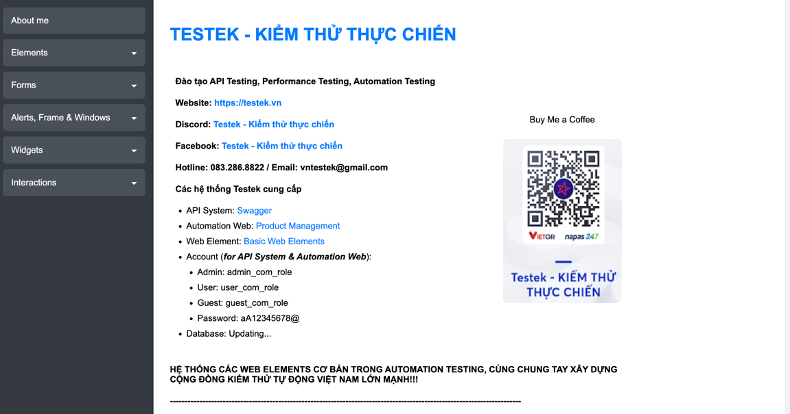

### Homework: XÁC ĐỊNH LOCATOR

1. Tìm kiếm toàn bộ phần tử trong page sau:
   Truy cập: https://testek.vn/lab/auto/web-elements/
   2. Truy cập domain
   3. Tìm kiếm toàn bộ các phần tử trong page
   
   
# Hướng dẫn
1. Sử dụng các locator sau:
   - CSS Selector
   - XPath <br/>
   Yêu cầu: Thực hiện xác định phần tử với cả 02 loại locator và các loại support của nó (nếu có, ví dụ id trong CSS Selector dùng #; class trong CSS Selector dùng .)
   
2. Sử dụng DevTools để xác định các locator
3. Sử dụng Selenium WebDriver để thực hiện tìm kiếm các phần tử
   1. Khai báo các biến là các locator cho từng phần tử
   2. Sử dụng mWebDriver để tìm kiếm các phần tử
   ```java
    String lblTitleXpath = "//h4[@name='db-title-name']";
    WebElement lblTitleElement = mWebDriver.findElement(By.xpath(lblTitleXpath));
    ```