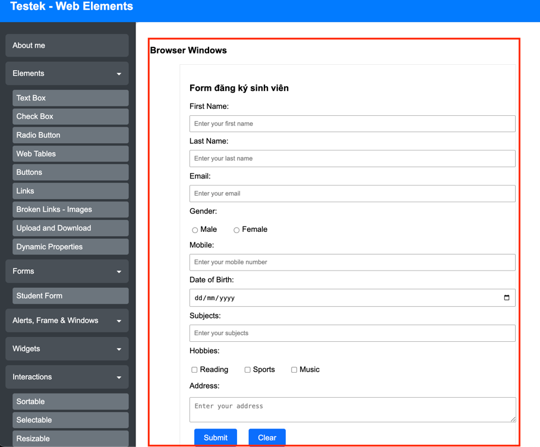
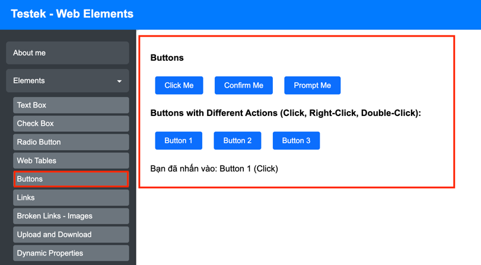
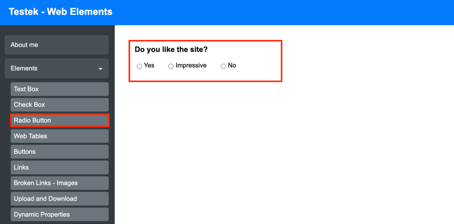

### Homework: TƯƠNG TÁC PHẦN TỬ

1. Tương tác với toàn bộ các phần tử trong page sau:
   1. Truy cập: https://testek.vn/lab/auto/web-elements/
   2. Truy cập Form > StudentForm
   3. Tìm kiếm toàn bộ các phần tử trong page
   
   
2. Thực hiện tương tác với các phần tử trong page sau:
   1. Truy cập: https://testek.vn/lab/auto/web-elements/
   2. Truy cập Elements > Buttons
   3. Tìm kiếm toàn bộ các phần tử trong page
   
   
3. Thực hiện tương tác với các phần tử trong page sau:
   1. Truy cập: https://testek.vn/lab/auto/web-elements/
   2. Truy cập Elements > RadioButtons
   3. Tìm kiếm toàn bộ các phần tử trong page
   
   

# Hướng dẫn
Lưu ý: Hướng dẫn chung cho toàn bộ các bài tập

1. Tìm kiếm toàn bộ các phần tử trong screen
2. Sử dụng Selenium WebDriver để thực hiện tìm kiếm các phần tử
   1. Khai báo các biến là các locator cho từng phần tử
   2. Sử dụng mWebDriver để tìm kiếm các phần tử và tương tác
   ```java
    String lblTitleXpath = "//h4[@test-id='db-website']/following-sibling::h4[@test-id='db-facebook']";
    WebElement lblTitleElement = mWebDriver.findElement(By.xpath(lblTitleXpath));
    ```