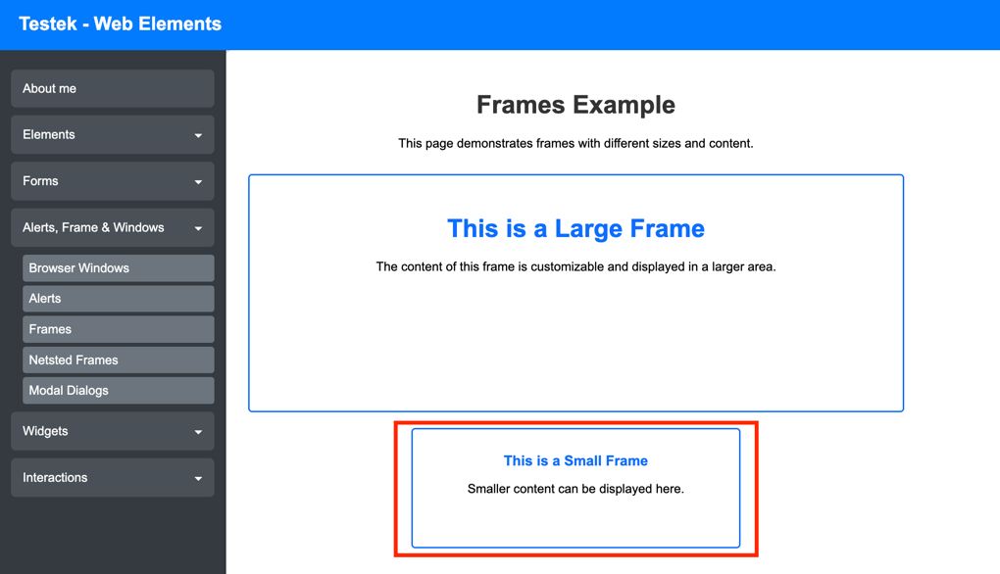
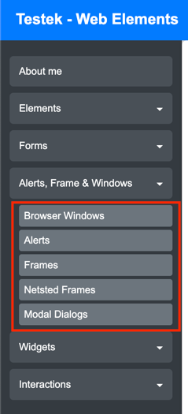
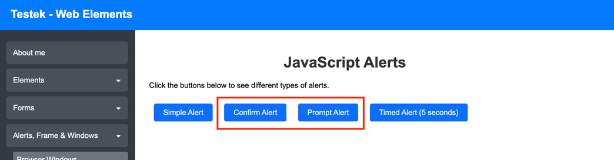

### Homework: TƯƠNG TÁC PHẦN TỬ

1. Tương tác với toàn bộ các phần tử trong page sau (sử dụng Action):
   1. Truy cập: https://testek.vn/lab/auto/web-elements/
   2. Truy cập Form > StudentForm
   3. Tìm kiếm toàn bộ các phần tử trong page

   

2. Thực hành tương tác với small frame
   1. Truy cập: https://testek.vn/lab/auto/web-elements/
   2. Truy cập Alert, Frame, Windows > Frame
   3. Thực hành tương tác với small frame
   
   
2. Thực hiện mở các menu ở 2 điều kiện:
   1. Mở trong tab mới
   2. Mở trong windows mới (mỗi windows đều có chứa 2 tab: Home và Tab được mở từ menu)
   3. Thực hiện switch các tab về home page
   
      
3. Thực hiện tương tác với toàn bộ các alert được mark trong hình:
   1. Truy cập: https://testek.vn/lab/auto/web-elements/
   2. Truy cập Alert, Frame, Windows > Alert
   3. Với mỗi alert hãy thực hiện các thao tác, và hiển thị thông tin text (nếu có) của alert đó
      1. Click 
      2. Confirm
      3. Prompt
      4. Show text of alert
   
   


### Hướng dẫn
1. Tìm kiếm toàn bộ các phần tử trong screen
2. Sử dụng Selenium WebDriver để thực hiện tìm kiếm các phần tử
   1. Khai báo các biến là các locator cho từng phần tử
   2. Sử dụng mWebDriver để tìm kiếm các phần tử và tương tác
   ```java
    String lblTitleXpath = "//h4[@test-id='db-website']/following-sibling::h4[@test-id='db-facebook']";
    WebElement lblTitleElement = mWebDriver.findElement(By.xpath(lblTitleXpath));
    ```

