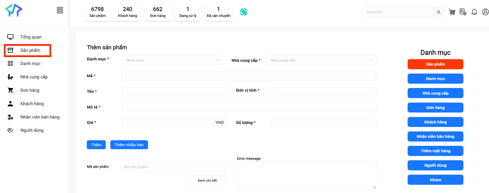

### Homework: TƯƠNG TÁC PHẦN TỬ

1. Thực hiện phát triển script tự động cho kịch bản manual như sau:
   1. Truy cập: https://testek.vn/lab/auto/login
   2. Thưc hiện đăng nhập với tài khoản:
      - Tài khoản: admin_com_role
      - Mật khẩu: aA12345678@
   3. Thực hiện truy cập [Sản phẩm]
   4. Thực hiện add mới sản phẩm với các thông tin như sau:
      - Danh mục: Máy giặt
      - Nhà cung câp: LG VietNam
      - Mã sản phẩm: AUTO202505_LG_[YOUR NAME]_[Timestamp]
      - Tên sản phẩm: Máy giặt AUTO202505_LG_[YOUR NAME]_[Timestamp]
      - Đơn vị tính: Chiếc
      - Mô tả: Máy giặt LG - Được xây dựng bởi AUTO202505_LG_[YOUR NAME]_[Timestamp]
      - Giá: 10000000
      - Số lượng: 10
   5. In ra thông tin được lấy từ [Error message] và [Mã sản phẩm] sau khi thêm sản phẩm thành công




### Hướng dẫn
1. Tìm kiếm toàn bộ các phần tử trong screen
2. Sử dụng Selenium WebDriver để thực hiện tìm kiếm các phần tử
3. Xây dựng các method tương tác với các phần tử
4. Sử dụng Action, Wait, JavaScript để thực hiện tương tác với các phần tử

Lưu ý: Hãy viết thành các base method, ví dụ:
- clickButton (By by); 
- sendKeys (By by, String text); 
- chooseOption (By by, String text);
- ... để có thể sử dụng lại cho các bài sau.


Ví dụ: Sử dụng các loại wait & method support để thực hiện phát triển script
```java
   /**
    * Wait for element clickable
    */
    private WebElement waitForElementClickable(By by) {
        log.info("Waiting for element clickable: {}", by);
        return mWebDriverWait.until(ExpectedConditions.elementToBeClickable(by));
    }


   /**
    * Send keys to element
    */
   private void sendKeysToElement(By by, String text, boolean isClear) {
      log.info("Send keys to element: {}", by);
      WebElement element = waitForElement(by);
      if (element == null) {
         log.error("Element not found: {}", by);
         return;
      }
   
      // Clear the text if isClear = true
      if (isClear) {
         element.clear();
      }
      element.sendKeys(text);
      log.info("Send keys to element: {}", text);
   }


   /**
    * Click on element
    */
   private void clickOnElement(By by) {
       log.info("Click on element: {}", by);
       WebElement element = waitForElementClickable(by);
       if (element == null) {
           log.error("Element not found: {}", by);
           return;
       }
       element.click();
       // Can add JS click if needed
       log.info("Click on element: {}", by);
   }
```

